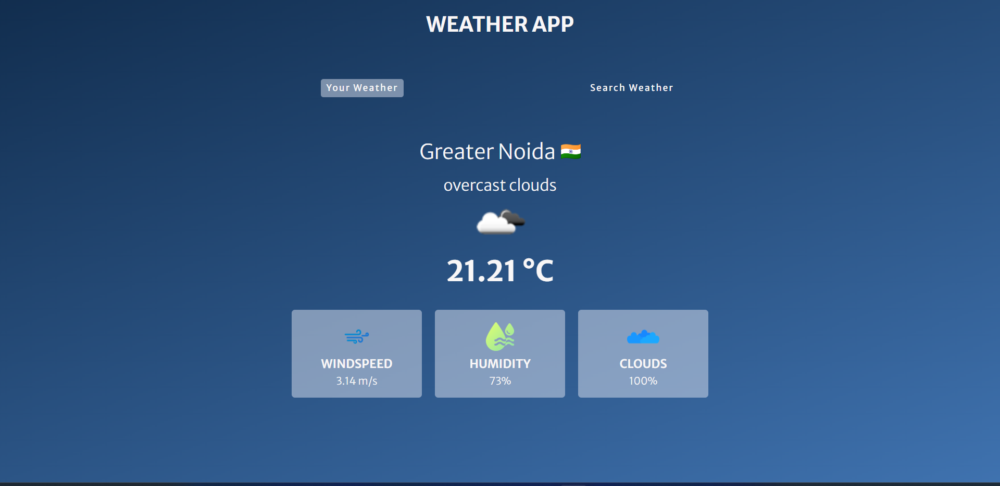

## Weather App

This project is a simple weather application that allows users to check the current weather and forecast for a location using 'OpenWeather API'...

## Features

<ol>
<li>Current weather information (temperature, humidity, wind speed, and weather condition) </li>
<li>Automatic location detection using the browser's geolocation API  </li>
<li>Search for weather by city name or ZIP code</li>
</ol>

## Technologies Used
<ol>
<li>HTML/CSS/JavaScript</li>
<li>OpenWeatherMap API</li>
</ol>

## Take a look
<ol>
<li>https://tubular-elf-4165f3.netlify.app</li>  or  <li>Clone the repository: git clone https://github.com/ramgpal/WeatherApp.git</li>

## Here's an image of my project:

